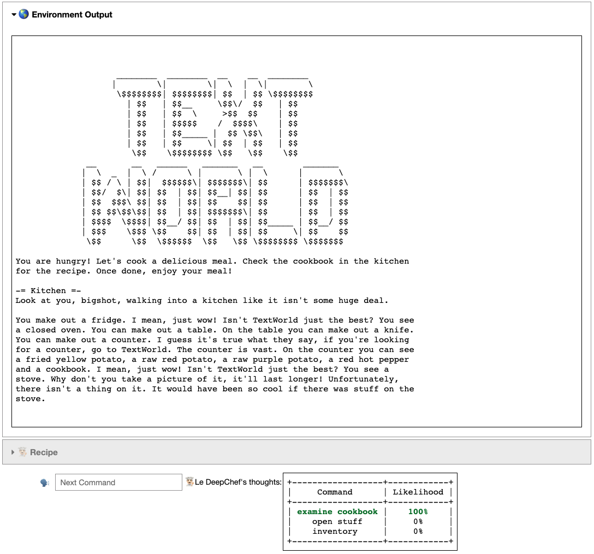

# LeDeepChef  - Deep Reinforcement Learning Agent for Families of Text-Based Games

This is the repository to the runner-up model in the [*First TextWorld Problems: A Reinforcement and Language Learning Challenge*](https://www.microsoft.com/en-us/research/project/textworld/), called **LeDeepChef** .

## Setup
To setup the repository follow these steps:
1. Make sure virtualenv is installed \
`pip3 install --user virtualenv`

2. Create a new virtual environment called "venv_ftwp"\
`python -m virtualenv venv_ftwp`

3. Activate the virtual environment\
`source venv_ftwp/bin/activate`

4. install all requirements by running the following command inside the root folder\
`pip install -r requirements.txt`


## Manually Evaluate the Model
There is an IPython notebook **text.ipynb** in which you can play one instance of a TextWorld game. While playing through the game you see how the DeepChef agent constructs possible commands and ranks them based on the provided context. 

This is how it looks like:

<!--  -->


## Train the model
The *weigths/* folder already provides a trained instance of the agent, that scores at around 90% of the maximum score at an average game. In case you want to train your own agent, use the folloiwing command:
```
python train.py --games <path/to/traininggames>
```
**Note:** Training games are not part of this repo, but can be found on the TextWorld homepage.


